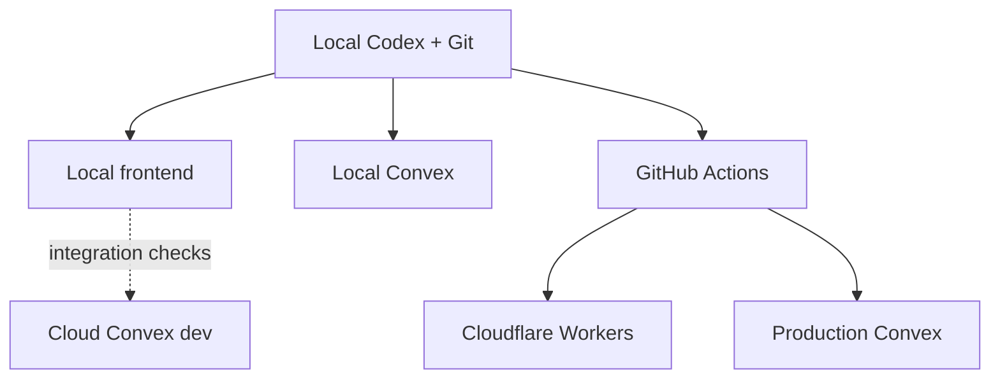

# Know Your Ballot architecture and decision record

Last updated: 2026-07-24  
Repository baseline reviewed: `arimxyer/kyb@f6fcca3`

## Purpose

This record captures the present system, the intended architecture, the
reasoning behind the decisions, superseded paths, and the order of work. It is
the handoff contract for local Codex development.

KYB is an evidence-first voter-information product. The current NY-04 pilot
proves the candidate, race, evidence, finance, endorsement, office-history,
source-refresh, and editorial-review data model. The next phase turns that pilot
into a locally developed, directly hosted, dependable product.

## Current state

| Area | Current reality |
|---|---|
| Product coverage | NY-04 / ZIP 11557 pilot |
| Frontend | Next.js API surface currently built by vinext/Vite |
| Current frontend host | Owner-only ChatGPT Sites deployment |
| Backend | Convex |
| Production Convex | `https://warmhearted-raccoon-48.convex.cloud` |
| Cloud development Convex | `https://sleek-snail-205.convex.cloud` |
| Production data | Seeded election, race, three candidates, claims, sources, finance, endorsements, and office history |
| Ingestion | Hourly custom Convex source refresh with snapshots and change detection |
| Review | Private internal draft/review/publish functions; no authenticated editor UI yet |
| Repository residue | Unused D1/Drizzle files and Sites-specific build/auth helpers remain |
| Planned components | Not installed yet |

The application is not currently splitting runtime reads between Convex and
D1. D1 and Drizzle are inactive starter residue. `lib/voter-data.ts` is imported
only by the Convex seed and is a fixture, not a runtime database.

## Target architecture



The local machine controls development. Production remains hosted and does not
depend on a developer computer being online.

## Decision register

| Area | Status | Decision |
|---|---|---|
| Application backend | Decided | Convex is the sole backend and application database |
| Default development backend | Decided | Local Convex |
| Cloud development backend | Decided | Integration-testing lane |
| Production backend | Decided | Existing hosted Convex production deployment |
| Frontend runtime | Decided | Next.js deployed to Cloudflare with OpenNext |
| Current vinext path | Superseded after migration | Keep only until OpenNext behavior and deployment are verified |
| ChatGPT Sites | Superseded | No future deployments; remove repository integration during cleanup |
| Drizzle and D1 | Superseded | Remove entirely |
| CI/CD | Decided | GitHub Actions with protected production promotion |
| Editor identity | Decided | Convex Auth, GitHub OAuth initially |
| Editor authorization | Decided | Convex role membership and server-side permission checks |
| Convex component set | Planned | Adopt Workflow, Workpool, Action Cache, Rate Limiter, R2, RAG, and Agent at their mapped milestones |
| Candidate scoring | Rejected | No candidate ranking or opaque trust score |
| AI role | Decided | Evidence retrieval and explanation with citations and abstention |

Decisions marked “Decided” are not invitations for a new agent to restart the
architecture discussion. A decision may change only when implementation
evidence reveals a real incompatibility; document that evidence here first.

## ADR-001: Convex is the only application backend

### Decision

Use Convex for structured election data, source metadata, review state,
scheduling, authentication, authorization, file metadata, and AI workflow
state.

Remove:

- `db/`
- `drizzle/`
- `drizzle.config.ts`
- `examples/d1/`
- `drizzle-orm`
- `drizzle-kit`
- `db:generate`
- D1 bindings and documentation

Move `lib/voter-data.ts` to an explicit fixture location such as
`convex/fixtures/prototype.ts` and keep it seed-only.

### Why

No product route imports the D1 helper. Keeping two data stacks creates false
choices, duplicate migration concepts, extra dependencies, and a high risk that
future work writes to the wrong backend.

### Acceptance

- No Drizzle or D1 dependency, binding, import, script, example, or generated
  migration remains.
- All runtime reads and writes continue through Convex.
- Prototype fixtures are clearly labeled and cannot be imported by frontend
  runtime code.

## ADR-002: local-first development with three explicit lanes

### Decision

Daily development uses a local frontend and local Convex. The existing cloud
development deployment is used for integration tests that need hosted crons,
public callbacks, shared state, or cloud behavior. Production uses only the
production deployment.

Create/select local Convex once with:

```bash
npx convex deployment create local --select
```

Select an existing local deployment later with:

```bash
npx convex deployment select local
```

Return to the personal cloud development deployment with:

```bash
npx convex deployment select dev
```

### Why

Local Convex calls and bandwidth do not consume cloud plan quota. Local mode
also gives agents disposable data, safe schema experimentation, persistent CLI
control, and a complete test loop. Cloud development remains valuable because
local mode has no public URL without a tunnel and does not reproduce every
hosted integration.

### Required guards

- Local startup fails if `NEXT_PUBLIC_CONVEX_URL` equals the production URL.
- Production deploy commands are not aliases of ordinary `dev`, `build`, or
  `test` commands.
- Environment files never contain deploy keys in Git.
- Test fixtures target local or isolated preview deployments.

References:

- https://docs.convex.dev/cli/local-deployments
- https://docs.convex.dev/cli/reference/deployment
- https://docs.convex.dev/cli/agent-mode

## ADR-003: migrate the frontend to Cloudflare OpenNext

### Decision

Move from the current Sites/vinext build path to actual Next.js built and
deployed with `@opennextjs/cloudflare`.

### Evaluation performed

On 2026-07-24 the repository was tested both ways:

- The existing vinext production build passed.
- A temporary OpenNext migration used Next.js `16.2.11`,
  `@opennextjs/cloudflare` `1.20.2`, a standard `wrangler.jsonc`, and
  `open-next.config.ts`.
- The complete application compiled, typechecked, rendered all six routes, and
  produced `.open-next/worker.js`.
- No application component or route code needed to change for the OpenNext
  build.

The existing repository pins Next.js `16.2.6`. Upgrade to at least `16.2.11`
during migration because the current OpenNext adapter requires the patched
Next.js line and Cloudflare's July 2026 security guidance identifies patched
16.2 releases.

### Why

OpenNext is Cloudflare's documented standard Next.js adapter and preserves
actual Next.js behavior. Vinext remains an experimental Vite-based
reimplementation. Since this application passes OpenNext without product-code
changes, retaining vinext would preserve experimental adapter risk without a
material migration benefit.

### Migration scope

- Add `@opennextjs/cloudflare`.
- Add `open-next.config.ts` and a standard `wrangler.jsonc`.
- Use `next dev` for the fast local frontend loop.
- Add an OpenNext/`workerd` preview command for production-runtime checks.
- Build and deploy with the OpenNext Cloudflare CLI.
- Remove `vite.config.ts`, `worker/index.ts`, `build/sites-vite-plugin.ts`,
  vinext/Vite-only dependencies, and Sites build scripts after parity passes.

### Acceptance

- Home, ballot lookup, race comparison, candidate detail, and research routes
  match existing behavior.
- Convex reactive queries work in local, Worker preview, and Cloudflare.
- Responsive/mobile navigation and loading/error states pass browser tests.
- OpenNext build, Worker preview, and deploy commands are documented.
- No `.openai/hosting.json` or Sites artifact validation remains.

References:

- https://developers.cloudflare.com/workers/framework-guides/web-apps/nextjs/
- https://blog.cloudflare.com/vinext/

## ADR-004: retire ChatGPT Sites

### Decision

Stop publishing to ChatGPT Sites immediately. Remove its repository integration
during the OpenNext cleanup. GitHub and direct Cloudflare deployment are the
only forward path.

The existing Sites deployment is owner-only, so retiring it does not expose the
pilot publicly. The available Sites management interface does not expose
project deletion; delete the project from the Sites UI if complete endpoint
removal is required. Regardless, no future code or deployment process may
depend on it.

Remove:

- `.openai/hosting.json`
- `app/chatgpt-auth.ts`
- `build/sites-vite-plugin.ts`
- Sites-only install/build/validation scripts
- Sites-specific README instructions and environment wrappers

ChatGPT Sites authentication is not the product authentication model.

## ADR-005: GitHub-driven validation and release

### Decision

Use GitHub Actions as the continuous validation and release control plane.

Pull requests must run:

1. locked dependency install
2. TypeScript
3. ESLint
4. unit/backend tests
5. browser tests against local Convex
6. OpenNext production build
7. targeted Worker-preview smoke tests

Merges to `main` may promote to production only after all checks pass and the
protected `production` environment is approved. The release job deploys Convex
first, builds the frontend with the production Convex URL supplied by the
release environment, then deploys the exact tested frontend commit to
Cloudflare.

Required secrets belong in GitHub/Cloudflare/Convex configuration, never the
repository:

- production-scoped `CONVEX_DEPLOY_KEY`
- Cloudflare account identifier
- least-privilege Cloudflare API token
- authentication provider credentials

Branch previews should use isolated Convex preview deployments when backend
changes need hosted verification.

## ADR-006: Convex Auth and role-based editorial controls

### Decision

Use Convex Auth with GitHub OAuth for the initial internal editor sign-in.
Public voter content remains anonymous and read-only. Public voter accounts are
a later product decision and must not delay editor security.

Add role membership in Convex:

| Role | Permissions |
|---|---|
| `owner` | Manage editor access and perform all editorial actions |
| `editor` | Create and revise drafts; submit for review |
| `reviewer` | Review source changes; approve or reject drafts |
| `publisher` | Publish approved drafts |

An owner may hold all permissions. Other users may hold multiple explicit
roles.

### Security model

- Convex Auth owns identity and sessions.
- An indexed membership table maps the authenticated Convex user ID to roles.
- Public queries expose only published claims and safe source metadata.
- Editorial queries and mutations call a shared authorization helper before
  accessing private excerpts, snapshots, drafts, or events.
- The server derives the audit actor from auth context. Remove client-supplied
  actor strings.
- Review events store the actor's user ID and immutable action metadata.
- Bootstrap the first owner through an internal, explicit setup mutation; never
  hard-code an email as permanent authorization.
- Approval and publication remain separate state transitions even when the
  initial owner can perform both.

### Acceptance

- Anonymous users cannot access the review queue or any editorial mutation.
- An authenticated user with no role is also denied.
- Every role boundary has backend tests.
- Audit events identify the authenticated actor.
- Auth configuration and secrets exist independently in local, integration,
  preview, and production environments.

References:

- https://labs.convex.dev/auth
- https://labs.convex.dev/auth/authz
- https://docs.convex.dev/auth/overview

## ADR-007: planned Convex component architecture

These components are planned architecture. They are deliberately installed
with the feature that proves them, not all at once.

| Component | KYB responsibility | Adoption acceptance |
|---|---|---|
| `@convex-dev/workflow` | Durable source lifecycle: fetch, snapshot, compare, extract, queue review, and record outcome | A run resumes after a forced mid-step failure; repeated runs are idempotent; step status is observable |
| `@convex-dev/workpool` | Bounded parallel source refresh and extraction queues | At least 100 sources process without action timeout; concurrency is configurable; transient failures retry without duplicate review items |
| `@convex-dev/action-cache` | Cache expensive fetch normalization and AI extraction keyed by content hash plus extractor version | Cache hits avoid duplicate external work; invalidation is explicit; cached output can never publish without review |
| `@convex-dev/rate-limiter` | Per-origin ingestion limits, editorial-write protection, and future public AI limits | Limits are identity/origin aware; burst and sustained limits are tested; responses expose a usable retry time |
| `@convex-dev/r2` | Archive large raw HTML, PDFs, screenshots, and other source artifacts; Convex retains metadata and review relationships | Checksums and content types are stored; signed access is bounded; structured application records remain in Convex |
| `@convex-dev/rag` | Index approved evidence chunks for semantic retrieval with race, candidate, source, and version metadata | Retrieval cannot return drafts; every chunk resolves to a source; filters prevent cross-race leakage |
| `@convex-dev/agent` | Evidence-grounded conversational Q&A with persistent threads and retrieval tools | Answers use retrieval tools, cite sources, abstain when evidence is insufficient, and have no editorial write capability |

### Adoption sequence

1. Rate Limiter with authenticated editorial endpoints.
2. Workpool for bounded source refresh concurrency.
3. Workflow for end-to-end durable ingestion.
4. Action Cache for external fetch/extraction reuse.
5. R2 when raw artifacts exceed the appropriate Convex document/storage shape.
6. RAG after approved evidence boundaries are enforced.
7. Agent after RAG citation and abstention tests pass.

If a component fails its acceptance test, record the package version, test,
observed mismatch, and replacement decision here. Absence from the current
manifest is not evidence against adoption.

Component references:

- https://www.convex.dev/components/workflow
- https://www.convex.dev/components/workpool
- https://www.convex.dev/components/action-cache
- https://www.convex.dev/components/rate-limiter
- https://www.convex.dev/components/cloudflare-r2
- https://www.convex.dev/components/rag
- https://www.convex.dev/components/agent

## Product principles that govern implementation

### Evidence before interpretation

Every substantive candidate statement should resolve to a source and an
evidence classification. Presentation may summarize; it may not erase
provenance or uncertainty.

### Review before publication

Automated systems may detect changes and propose drafts. They may not silently
alter public candidate evidence.

### Neutral structure, not false equivalence

KYB presents comparable categories and sourcing standards. It does not force
equal amounts of evidence when the underlying public record differs.

### No ranking layer

The product does not calculate a “best candidate,” ideology score, honesty
score, or generalized trust score.

### AI must be inspectable

AI output must be grounded in retrievable evidence, linked to citations, and
able to return “not enough evidence.” Prompts or model confidence are not a
substitute for source support.

## Superseded and rejected paths

| Path | Status | Reason |
|---|---|---|
| D1 + Drizzle application backend | Superseded | Inactive duplicate data stack |
| ChatGPT Sites as production host | Superseded | Development and deployment friction; direct Cloudflare is the intended platform |
| ChatGPT/Sites identity headers | Superseded | Not portable product authentication |
| Cloud Convex as the default daily backend | Superseded | Local Convex provides isolation and avoids cloud quota usage |
| Running production from a local computer | Rejected | Production must remain continuously hosted |
| Candidate ranking/trust scoring | Rejected | Conflicts with evidence-first product purpose |
| Unreviewed automatic publication | Rejected | Creates unacceptable accuracy and accountability risk |

## Delivery sequence

### Milestone 1: architecture cleanup and OpenNext

- Upgrade Next.js to a patched supported release.
- Remove D1/Drizzle and Sites residue.
- Move the prototype seed fixture.
- Migrate to OpenNext.
- Add local, cloud-integration, Worker-preview, and deployment scripts.
- Add a hard production-URL guard to local startup.
- Preserve all current routes and responsive behavior.

### Milestone 2: CI/CD and test lanes

- Add GitHub pull-request validation.
- Add local Convex fixture reset/seed helpers.
- Add browser coverage for the main voter flows.
- Configure protected production promotion to Convex and Cloudflare.

### Milestone 3: authenticated editorial workflow

- Add Convex Auth with GitHub OAuth.
- Add role membership and authorization helpers.
- Replace internal-only review operations with authenticated, role-gated public
  functions where the client must call them.
- Build the editor review queue and approve/reject/publish controls.
- Migrate audit actors from strings to authenticated user references.

### Milestone 4: durable ingestion

- Adopt Rate Limiter, Workpool, Workflow, Action Cache, and R2 in the documented
  sequence.
- Add source-specific adapters, retries, observability, and change extraction.

### Milestone 5: evidence-grounded AI Q&A

- Adopt RAG and Agent.
- Enforce citation, publication-state filters, and abstention.

### Milestone 6: ballot and coverage expansion

- Address-to-district resolution.
- Federal, state, county, judicial, and local races.
- Freshness policy, monitoring, backups, and production reliability.

## Immediate handoff

The next local agent starts with Milestone 1. It should not add the editorial UI
on top of the current Sites/D1 residue. The cleanup must preserve the working
NY-04 Convex-backed prototype while making the repository accurately describe
its real architecture.

