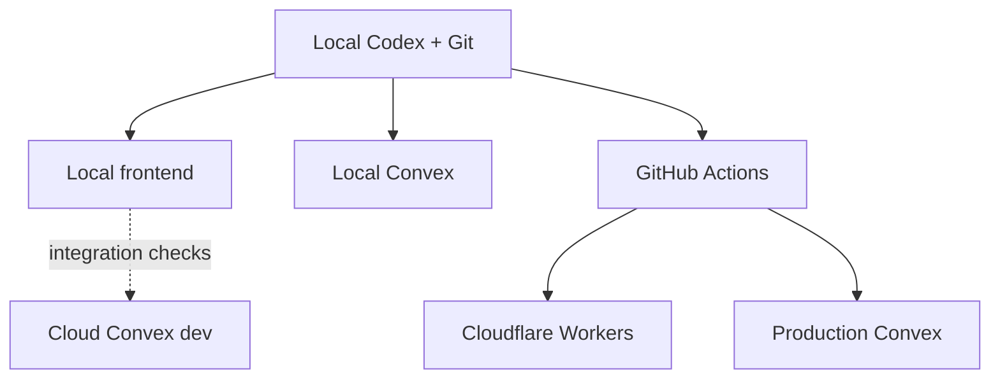

# Know Your Ballot architecture and decision record

Last updated: 2026-07-25
Repository baseline reviewed: `arimxyer/kyb@f6fcca3`

## Purpose

This record captures the present system, the intended architecture, the
reasoning behind the decisions, superseded paths, and the order of work. It is
the handoff contract for local Codex development.

KYB is an evidence-first voter-information product. The current NY-04 pilot
proves the candidate, race, evidence, finance, endorsement, office-history,
source-refresh, and editorial-review data model. The next phase turns that pilot
into a locally developed, directly hosted, dependable product.

## Current state

| Area | Current reality |
|---|---|
| Product coverage | NY-04 / ZIP 11557 pilot |
| Frontend | Next.js `16.2.11` built for Cloudflare Workers with OpenNext `1.20.2` |
| Current frontend host | Cloudflare Worker at `https://know-your-ballot.ari111097.workers.dev` |
| Backend | Convex |
| Production Convex | `https://warmhearted-raccoon-48.convex.cloud` |
| Cloud development Convex | `https://sleek-snail-205.convex.cloud` |
| Local development Convex | Local deployment on `http://127.0.0.1:3210` when `bunx convex dev` is running |
| Production data | Seeded election, race, three candidates, claims, sources, finance, endorsements, and office history |
| Integration data | Prototype fixture synced and seeded on 2026-07-24 |
| Ingestion | Hourly custom Convex source refresh with snapshots and change detection |
| Review | Private internal draft/review/publish functions; no authenticated editor UI yet |
| Package and lint baseline | Bun `1.3.14`; Oxlint `1.75.0` with type-aware rules; TypeScript `6.0.3` |
| Repository residue | Sites/vinext/Vite and D1/Drizzle code, scripts, dependencies, and manifests removed |
| Planned components | Not installed yet |

The application does not split runtime reads or writes across backends. Convex
is the only application backend. The prototype data now lives at
`convex/fixtures/prototype.ts` and is imported only by the Convex seed.

## Target architecture



The local machine controls development. Production remains hosted and does not
depend on a developer computer being online.

## Decision register

| Area | Status | Decision |
|---|---|---|
| Application backend | Decided | Convex is the sole backend and application database |
| Default development backend | Decided | Local Convex |
| Cloud development backend | Decided | Integration-testing lane |
| Production backend | Decided | Existing hosted Convex production deployment |
| Frontend runtime | Decided | Next.js deployed to Cloudflare with OpenNext |
| Package manager | Decided | Bun with a committed `bun.lock` and frozen CI installs |
| Current vinext path | Removed | OpenNext behavior and Worker preview are verified |
| ChatGPT Sites | Removed | No future deployments; repository integration is gone |
| Drizzle and D1 | Removed | Convex is the sole backend |
| CI/CD | Decided | GitHub Actions with protected production promotion |
| Editor identity | Decided | Convex Auth, GitHub OAuth initially |
| Editor authorization | Decided | Convex role membership and server-side permission checks |
| Convex component set | Planned | Adopt Workflow, Workpool, Action Cache, Rate Limiter, R2, RAG, and Agent at their mapped milestones |
| Candidate scoring | Rejected | No candidate ranking or opaque trust score |
| AI role | Decided | Evidence retrieval and explanation with citations and abstention |

Decisions marked “Decided” are not invitations for a new agent to restart the
architecture discussion. A decision may change only when implementation
evidence reveals a real incompatibility; document that evidence here first.

## ADR-000: Bun and current stable dependencies

### Decision

Use Bun as the sole package manager. Pin the Bun version through
`packageManager`, commit `bun.lock`, and use `bun install --frozen-lockfile`
locally and in CI when verifying reproducibility. Do not add npm, pnpm, or Yarn
lockfiles.

At the start of a milestone, upgrade retained dependencies to the latest
mutually compatible stable releases and validate the complete application.
Packages already scheduled for deletion are removed at their planned milestone
instead of being upgraded for their own sake.

### Linter and TypeScript compatibility resolution

On 2026-07-24, Phase 0 first established TypeScript `6.0.3` and ESLint
`9.39.4` as the newest mutually compatible baseline. A reversible spike then
showed that the standalone TypeScript 7 CLI and the old vinext lane could pass
with Oxlint, but intentionally deferred adoption until the real Next/OpenNext
runtime existed.

Milestone 1 reran the decision against Next.js `16.2.11`, OpenNext `1.20.2`,
and local `workerd`:

- `@oxlint/migrate` translated 68 active ESLint rules and reported 17
  unsupported rules. Two are obsolete under the modern JSX transform, one is
  covered by the type-aware `typescript/no-deprecated` rule, and the remaining
  React Compiler checks are represented by Oxlint's experimental aggregate
  `react/react-compiler` rule.
- The retained config enables the full correctness category, migrated Next.js,
  React, import, accessibility, and TypeScript rules, type-aware linting through
  `oxlint-tsgolint` `7.0.2001`, and `--deny-warnings`.
- The stricter pass identified six issues the previous ESLint baseline did not:
  React 19 submit-event types, a floating OpenNext initialization promise, two
  opportunities for native status/progress elements, and two component-level
  accessibility findings. The real findings were fixed; the reusable label
  primitive has one narrow documented suppression because association belongs
  to each call site.
- TypeScript `7.0.2` still passes standalone `tsc --noEmit`, Oxlint, unit
  tests, and the Convex CLI. However, Next.js `16.2.11` does not accept the
  TypeScript 7 package as its production-build compiler. `next build` attempted
  to install TypeScript through npm and then failed before page generation with
  an invalid compiler-module result.

Therefore KYB adopts Oxlint `1.75.0` and removes ESLint, while retaining
TypeScript `6.0.3`. Revisit TypeScript 7 only when the exact Next and OpenNext
production builds pass without fallback package installation.

### Acceptance

- `bun.lock` is the only package-manager lockfile.
- A frozen Bun install succeeds from a clean dependency directory.
- TypeScript, type-aware Oxlint, the frontend build, and tests pass on the
  resolved set.
- Any package held below latest stable has a concrete compatibility reason.
- Superseded Sites, vinext, Vite, D1, and Drizzle dependencies are removed.

## ADR-001: Convex is the only application backend

### Decision

Use Convex for structured election data, source metadata, review state,
scheduling, authentication, authorization, file metadata, and AI workflow
state.

Remove:

- `db/`
- `drizzle/`
- `drizzle.config.ts`
- `examples/d1/`
- `drizzle-orm`
- `drizzle-kit`
- `db:generate`
- D1 bindings and documentation

Move `lib/voter-data.ts` to an explicit fixture location such as
`convex/fixtures/prototype.ts` and keep it seed-only.

### Why

No product route imports the D1 helper. Keeping two data stacks creates false
choices, duplicate migration concepts, extra dependencies, and a high risk that
future work writes to the wrong backend.

### Acceptance

- No Drizzle or D1 dependency, binding, import, script, example, or generated
  migration remains.
- All runtime reads and writes continue through Convex.
- Prototype fixtures are clearly labeled and cannot be imported by frontend
  runtime code.

Implementation status: complete on 2026-07-24.

## ADR-002: local-first development with three explicit lanes

### Decision

Daily development uses a local frontend and local Convex. The existing cloud
development deployment is used for integration tests that need hosted crons,
public callbacks, shared state, or cloud behavior. Production uses only the
production deployment.

Create/select local Convex once with:

```bash
bunx convex deployment create local --select
```

Select an existing local deployment later with:

```bash
bunx convex deployment select local
```

Return to the personal cloud development deployment with:

```bash
bunx convex deployment select dev
```

### Why

Local Convex calls and bandwidth do not consume cloud plan quota. Local mode
also gives agents disposable data, safe schema experimentation, persistent CLI
control, and a complete test loop. Cloud development remains valuable because
local mode has no public URL without a tunnel and does not reproduce every
hosted integration.

### Required guards

- Local startup fails if `NEXT_PUBLIC_CONVEX_URL` equals the production URL.
- Production deploy commands are not aliases of ordinary `dev`, `build`, or
  `test` commands.
- Environment files never contain deploy keys in Git.
- Test fixtures target local or isolated preview deployments.

Implemented commands:

- `bun run dev` / `bun run dev:local`
- `bun run dev:integration`
- `bun run preview` / `bun run preview:local`
- `bun run preview:integration`
- `bun run deploy:production`

The production command requires the exact production Convex URL, `CI=true`,
`GITHUB_ACTIONS=true`, and `KYB_ALLOW_PRODUCTION_DEPLOY=1`. Guard unit tests
verify local and integration acceptance plus production rejection. A local
deployment was created, pushed, seeded, and browser-tested on 2026-07-24. The
cloud development deployment was also synchronized and seeded for integration
browser verification.

References:

- https://docs.convex.dev/cli/local-deployments
- https://docs.convex.dev/cli/reference/deployment
- https://docs.convex.dev/cli/agent-mode

## ADR-003: migrate the frontend to Cloudflare OpenNext

### Decision

Use actual Next.js built and deployed with `@opennextjs/cloudflare`. The
Sites/vinext path is removed.

### Evaluation performed

On 2026-07-24 the repository was tested both ways and then migrated:

- The existing vinext production build passed.
- The retained OpenNext migration uses Next.js `16.2.11`,
  `@opennextjs/cloudflare` `1.20.2`, a standard `wrangler.jsonc`, and
  `open-next.config.ts`.
- The complete application compiled, typechecked, rendered all six routes, and
  produced `.open-next/worker.js`.
- The local Next lane and the OpenNext/`workerd` lane both hydrated Convex data
  from the local deployment.
- The Worker preview served home, ballot, race, both tested candidate profiles,
  and research routes with HTTP 200 responses. Desktop and 390-pixel mobile
  browser checks found no framework overlay, console error, horizontal
  overflow, or missing mobile navigation.
- The integration check initially exposed an out-of-date cloud development
  deployment. After a non-production `convex dev --once` sync and idempotent
  seed, the real ballot, comparison, candidate, and research UI hydrated
  without errors.
- An ignored legacy `.wrangler/deploy/config.json` redirected the first preview
  to the old vinext bundle. Removing that generated local state made Wrangler
  correctly use `wrangler.jsonc` and `.open-next/worker.js`.

The existing repository pins Next.js `16.2.6`. Upgrade to at least `16.2.11`
during migration because the current OpenNext adapter requires the patched
Next.js line and Cloudflare's July 2026 security guidance identifies patched
16.2 releases.

### Why

OpenNext is Cloudflare's documented standard Next.js adapter and preserves
actual Next.js behavior. Vinext remains an experimental Vite-based
reimplementation. Since this application passes OpenNext without product-code
changes, retaining vinext would preserve experimental adapter risk without a
material migration benefit.

### Migration result

- Added `@opennextjs/cloudflare`, `open-next.config.ts`, and `wrangler.jsonc`.
- `next dev` is the fast local frontend loop.
- OpenNext/`workerd` preview commands cover local and integration Convex.
- The protected production command uses the OpenNext Cloudflare CLI.
- `vite.config.ts`, `worker/index.ts`, `build/sites-vite-plugin.ts`,
  vinext/Vite-only dependencies, and Sites build scripts are removed.

### Acceptance

- Home, ballot lookup, race comparison, candidate detail, and research routes
  match existing behavior.
- Convex reactive queries work in local, Worker preview, and Cloudflare.
- Responsive/mobile navigation and loading/error states pass browser tests.
- OpenNext build, Worker preview, and deploy commands are documented.
- No `.openai/hosting.json` or Sites artifact validation remains.

Repository migration status: complete on 2026-07-24. Actual Cloudflare
production promotion remains Milestone 2 work and must go through GitHub
Actions.

References:

- https://developers.cloudflare.com/workers/framework-guides/web-apps/nextjs/
- https://blog.cloudflare.com/vinext/

## ADR-004: retire ChatGPT Sites

### Decision

Stop publishing to ChatGPT Sites immediately. Remove its repository integration
during the OpenNext cleanup. GitHub and direct Cloudflare deployment are the
only forward path.

The existing Sites deployment is owner-only, so retiring it does not expose the
pilot publicly. The available Sites management interface does not expose
project deletion; delete the project from the Sites UI if complete endpoint
removal is required. Regardless, no future code or deployment process may
depend on it.

Remove:

- `.openai/hosting.json`
- `app/chatgpt-auth.ts`
- `build/sites-vite-plugin.ts`
- Sites-only install/build/validation scripts
- Sites-specific README instructions and environment wrappers

ChatGPT Sites authentication is not the product authentication model.

## ADR-005: GitHub-driven validation and release

### Decision

Use GitHub Actions as the continuous validation and release control plane.

Pull requests must run:

1. locked dependency install
2. TypeScript
3. type-aware Oxlint with warnings denied
4. unit/backend tests
5. browser tests against local Convex
6. OpenNext production build
7. targeted Worker-preview smoke tests

Merges to protected `main` may be promoted only after all checks pass. During
the solo-maintainer phase, an explicit manual workflow dispatch, typed
confirmation, exact-commit validation, and branch-restricted production
environment form the approval boundary. A second-person reviewer becomes
required when another trusted maintainer exists; it is not a launch
prerequisite.

The release job deploys Convex first, builds the frontend with the production
Convex URL supplied by the release environment, then deploys the exact tested
frontend commit to Cloudflare.

Required secrets belong in GitHub/Cloudflare/Convex configuration, never the
repository:

- production-scoped `CONVEX_DEPLOY_KEY`
- Cloudflare account identifier
- least-privilege Cloudflare API token
- authentication provider credentials

Branch previews should use isolated Convex preview deployments when backend
changes need hosted verification.

Implementation status on 2026-07-25:

- Static, build, browser, local Worker, and same-repository Convex-preview
  workflows are committed.
- A manual production workflow is committed but fail-closed. It reruns
  validation for the exact commit, verifies the production Convex target,
  uploads an immutable Cloudflare candidate, tests its preview alias, promotes
  the exact version ID, and verifies the production URL.
- The first Cloudflare release bootstraps only a 503 maintenance Worker before
  candidate verification because Cloudflare cannot upload an undeployed first
  version.
- The repository is public after a pre-publication history and secret audit.
  Protected `main` and the branch-restricted production environment are active.
- The first production release completed through the protected workflow at
  commit `3cb3a7893516fb14e3bbd069bedd1e92e38dfd4f`. Cloudflare Worker version
  `8492f9d4-1444-4774-9f73-90776b44a9fd` serves 100 percent of traffic.
- `docs/RELEASE_SETUP.md` preserves the complete release receipt and the
  remaining durable Cloudflare-token setup.

## ADR-006: Convex Auth and role-based editorial controls

### Decision

Use Convex Auth with GitHub OAuth for the initial internal editor sign-in.
Public voter content remains anonymous and read-only. Public voter accounts are
a later product decision and must not delay editor security.

Add role membership in Convex:

| Role | Permissions |
|---|---|
| `owner` | Manage editor access and perform all editorial actions |
| `editor` | Create and revise drafts; submit for review |
| `reviewer` | Review source changes; approve or reject drafts |
| `publisher` | Publish approved drafts |

An owner may hold all permissions. Other users may hold multiple explicit
roles.

### Security model

- Convex Auth owns identity and sessions.
- An indexed membership table maps the authenticated Convex user ID to roles.
- Public queries expose only published claims and safe source metadata.
- Editorial queries and mutations call a shared authorization helper before
  accessing private excerpts, snapshots, drafts, or events.
- The server derives the audit actor from auth context. Remove client-supplied
  actor strings.
- Review events store the actor's user ID and immutable action metadata.
- Bootstrap the first owner through an internal, explicit setup mutation; never
  hard-code an email as permanent authorization.
- Approval and publication remain separate state transitions even when the
  initial owner can perform both.

### Acceptance

- Anonymous users cannot access the review queue or any editorial mutation.
- An authenticated user with no role is also denied.
- Every role boundary has backend tests.
- Audit events identify the authenticated actor.
- Auth configuration and secrets exist independently in local, integration,
  preview, and production environments.

References:

- https://labs.convex.dev/auth
- https://labs.convex.dev/auth/authz
- https://docs.convex.dev/auth/overview

## ADR-007: planned Convex component architecture

These components are planned architecture. They are deliberately installed
with the feature that proves them, not all at once.

| Component | KYB responsibility | Adoption acceptance |
|---|---|---|
| `@convex-dev/workflow` | Durable source lifecycle: fetch, snapshot, compare, extract, queue review, and record outcome | A run resumes after a forced mid-step failure; repeated runs are idempotent; step status is observable |
| `@convex-dev/workpool` | Bounded parallel source refresh and extraction queues | At least 100 sources process without action timeout; concurrency is configurable; transient failures retry without duplicate review items |
| `@convex-dev/action-cache` | Cache expensive fetch normalization and AI extraction keyed by content hash plus extractor version | Cache hits avoid duplicate external work; invalidation is explicit; cached output can never publish without review |
| `@convex-dev/rate-limiter` | Per-origin ingestion limits, editorial-write protection, and future public AI limits | Limits are identity/origin aware; burst and sustained limits are tested; responses expose a usable retry time |
| `@convex-dev/r2` | Archive large raw HTML, PDFs, screenshots, and other source artifacts; Convex retains metadata and review relationships | Checksums and content types are stored; signed access is bounded; structured application records remain in Convex |
| `@convex-dev/rag` | Index approved evidence chunks for semantic retrieval with race, candidate, source, and version metadata | Retrieval cannot return drafts; every chunk resolves to a source; filters prevent cross-race leakage |
| `@convex-dev/agent` | Evidence-grounded conversational Q&A with persistent threads and retrieval tools | Answers use retrieval tools, cite sources, abstain when evidence is insufficient, and have no editorial write capability |

### Adoption sequence

1. Rate Limiter with authenticated editorial endpoints.
2. Workpool for bounded source refresh concurrency.
3. Workflow for end-to-end durable ingestion.
4. Action Cache for external fetch/extraction reuse.
5. R2 when raw artifacts exceed the appropriate Convex document/storage shape.
6. RAG after approved evidence boundaries are enforced.
7. Agent after RAG citation and abstention tests pass.

If a component fails its acceptance test, record the package version, test,
observed mismatch, and replacement decision here. Absence from the current
manifest is not evidence against adoption.

Component references:

- https://www.convex.dev/components/workflow
- https://www.convex.dev/components/workpool
- https://www.convex.dev/components/action-cache
- https://www.convex.dev/components/rate-limiter
- https://www.convex.dev/components/cloudflare-r2
- https://www.convex.dev/components/rag
- https://www.convex.dev/components/agent

## Product principles that govern implementation

### Evidence before interpretation

Every substantive candidate statement should resolve to a source and an
evidence classification. Presentation may summarize; it may not erase
provenance or uncertainty.

### Review before publication

Automated systems may detect changes and propose drafts. They may not silently
alter public candidate evidence.

### Neutral structure, not false equivalence

KYB presents comparable categories and sourcing standards. It does not force
equal amounts of evidence when the underlying public record differs.

### No ranking layer

The product does not calculate a “best candidate,” ideology score, honesty
score, or generalized trust score.

### AI must be inspectable

AI output must be grounded in retrievable evidence, linked to citations, and
able to return “not enough evidence.” Prompts or model confidence are not a
substitute for source support.

## Superseded and rejected paths

| Path | Status | Reason |
|---|---|---|
| D1 + Drizzle application backend | Superseded | Inactive duplicate data stack |
| ChatGPT Sites as production host | Superseded | Development and deployment friction; direct Cloudflare is the intended platform |
| ChatGPT/Sites identity headers | Superseded | Not portable product authentication |
| Cloud Convex as the default daily backend | Superseded | Local Convex provides isolation and avoids cloud quota usage |
| Running production from a local computer | Rejected | Production must remain continuously hosted |
| Candidate ranking/trust scoring | Rejected | Conflicts with evidence-first product purpose |
| Unreviewed automatic publication | Rejected | Creates unacceptable accuracy and accountability risk |

## Delivery sequence

### Phase 0: package manager and dependency baseline

Status: complete on 2026-07-24.

- Migrated from npm to Bun with `bun.lock` as the only lockfile.
- Upgraded retained dependencies to their latest mutually compatible stable
  versions.
- Adopted type-aware Oxlint; retained TypeScript `6.0.3` because the actual
  Next.js build rejects the TypeScript 7 package.

### Milestone 1: architecture cleanup and OpenNext

Status: complete on 2026-07-24.

- Upgraded Next.js to `16.2.11`.
- Removed D1/Drizzle and Sites/vinext/Vite residue.
- Moved the prototype seed fixture to `convex/fixtures/prototype.ts`.
- Migrated to OpenNext `1.20.2`.
- Added local, cloud-integration, Worker-preview, and guarded production
  scripts.
- Added and tested hard environment-target guards.
- Preserved all current routes and responsive behavior in browser verification.

### Milestone 2: CI/CD and test lanes

Status: complete on 2026-07-25.

- Added GitHub pull-request validation.
- Added bounded, deterministic local Convex fixture reset/seed helpers.
- Added desktop/mobile browser coverage for the main voter flows.
- Added actual OpenNext/`workerd` smoke coverage.
- Added same-repository disposable Convex previews.
- Added a fail-closed production workflow with a maintenance-only first Worker,
  immutable candidate verification, and exact-version promotion.
- Published the sanitized repository, activated protected `main`, configured
  the production environment, and verified the hosted preview lane.

### Milestone 3: public read-only pilot

Status: launched and verified on 2026-07-25.

- Published the sanitized repository.
- Configured protected `main`, the branch-restricted production environment,
  and the Convex preview key.
- Ran the first production release through candidate verification and exact
  version promotion.
- Verified the public ballot, race, candidate, evidence, and research surfaces.
- Preserved the exact version rollback handle in `docs/RELEASE_SETUP.md`.
- Did not invoke a live rollback after the successful launch; rehearse that
  approved operation before the next high-risk release.
- Removed the temporary bootstrap credential and closed the release latch. A
  durable account-owned Cloudflare token remains required before the next
  release.

### Milestone 4: durable ingestion

This milestone now precedes the authenticated editorial UI. Publication remains
review-gated, but the solo phase uses backend-only internal review operations
rather than exposing a public write surface.

- Adopt Rate Limiter, Workpool, Workflow, Action Cache, and R2 in the documented
  sequence.
- Add source-specific adapters, retries, observability, and change extraction.

### Milestone 5: ballot and coverage expansion

- Address-to-district resolution.
- Federal, state, county, judicial, and local races.
- Freshness policy, monitoring, backups, and production reliability.

### Milestone 6: authenticated editorial workflow

- Add Convex Auth and role membership.
- Build authenticated review and publication controls.
- Replace temporary deployment-admin operations with audited user identities.

### Milestone 7: evidence-grounded AI Q&A

- Adopt RAG and Agent.
- Enforce citation, publication-state filters, and abstention.

## Immediate handoff

The public read-only pilot is live and its release receipt is preserved in
`docs/RELEASE_SETUP.md`. Prioritize source correctness, ingestion robustness,
freshness, observability, backend-only review operations, and election
coverage.

Before the next production release, create the durable, account-owned
Cloudflare token described in `docs/RELEASE_SETUP.md`; store it only in the
GitHub `production` environment and enable the repository release latch last.
Do not expose editorial writes before Convex Auth, and do not start AI Q&A
until authenticated review and retrieval boundaries are tested. Do not run
production deployment commands locally.

Verification receipts from 2026-07-24 and 2026-07-25:

- frozen Bun install: pass
- `bun run typecheck`: pass
- `bun run lint`: pass with type-aware Oxlint and denied warnings
- `bun run test`: guard, fixture, preview-export, and release-helper tests pass
- `bun run build`: pass; six App Router routes emitted
- `bun run build:worker`: pass; `.open-next/worker.js` emitted
- local Convex push and idempotent seed: pass
- integration Convex sync and idempotent seed: pass
- local Next hydration and local/integration Worker browser flows: pass
- hosted Convex preview and remote Worker browser flow: pass; Actions run
  `30137037640`
- protected production deployment: pass; Actions run `30137092041`
- Cloudflare Worker version
  `8492f9d4-1444-4774-9f73-90776b44a9fd`: 100 percent traffic
- independent production HTTP and remote Chromium voter journey: pass
